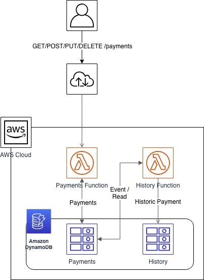

[](https://circleci.com/gh/richardcase/paymentsvc)
[](https://coveralls.io/github/richardcase/paymentsvc?branch=master) 

# Payments Service using Lambda

This is a sample that implements a simple Payments Service using AWS Lambda.

## Design

There were a number of requirements supplied that were taken into account with the design:

* Service should expose *RESTful* API that supports the following:
	*  Creating a new payment
	*  Updating an existing payment
	*  Deleting an existing payment
	*  Retrieving a payment
	*  Getting a list of payments
* All data should be persisted to a data store
* Solution should be "simple"




We decided to use a serverless approach to make the deployment story easier and to care less about the hosting environment. 

The service we expose has a number of endpoints. For each endpoint we could have created a separate function but in the end we decided to go for an approach where we have 1 function for all the endpoints of the service (i.e. service pattern). This is to help with cold start-up times. For a explanation of the service patterns and its alternatives read [this](https://serverless.com/blog/serverless-architecture-code-patterns/).

To aid with the implementation of the API we decided to use [Gin](https://github.com/gin-gonic/gin) as this provides many helpful features over the base "http" package such as parameter, body validation, query string parameter extraction etc.

The RESTful API will have the following endpoints:

| Method | Path | Purpose |
| ---------- | ------ | ----------- |
| GET | /payments | Get a list of payments |
| GET | /payments/:paymentid | Get a single payment |
| PUT | /payments/:paymentid | Update a payment |
| DELETE | /payments/:paymentid | Delete a payment |
| GET | /ready | Signals the service is ready to accept requests |
| GET | /alive | Is the service alive |

For the data storage we decided to use DynamoDB  as it is a very highly scalable, resilient and performant document database. It also integrates very well with lambda. For phase 2 we will use streams to have a history of all changes to a payment and to also create events for any consumers that are interested.

To aid with the development and deployment of the lambda function we create we decided to use the [Serverless Framework](https://serverless.com/).


## Running locally

To run the solution locally you will need at least 2 terminals:

In the first terminal run:

```bash
AWS_PROFILE=mon-dev make start-local-db
```

And then in the second terminal run:

```bash
AWS_PROFILE=mon-dev make populate-local-db
AWS_PROFILE=mon-dev make start-local-func
```

You can how call end points on the function running locally:

```bash
curl http://127.0.0.1:9000/payments
```

## Integration Tests

Running integration tests is only supported locally at present. To do that follow the steps in the _Running Locally_ section and then open a 3rd terminal window and run:

```bash
make integration-test-local
```

## Deployment

To deploy the functions and create the dynamodb table run the following from a terminal windows:

```bash
AWS_PROFILE=mon-dev make deploy
```

## Future

There are a number for future work:

- [ ] Get integration tests running against AWS
- [ ] Create unit tests for **DynamoDbRepository**
- [ ] Change local integration tests to use SAM local
- [ ] Implement **Payment History Function** that will use the DynamoDB table stream to create a separate table containing the history of all changes to a payment
- [ ] Add authentication and authorization
- [ ] Concurrency (using ETags or some other method)
- [ ] API Versioning (using Content-Type header)

## Scratch pad for future changes

docker network create lambda-local
docker run --rm -p 8000:8000 --network lambda-local --name dynamodb amazon/dynamodb-local -jar DynamoDBLocal.jar -inMemory -sharedDb

docker run --network lambda-local -v $(pwd)/bin:/var/task -i -t --rm --env-file deployment/env/integration.env  lambci/lambda:go1.x payments

cat test/integration/full_lifecycle_test.go | docker run --network lambda-local -v $(pwd)/bin:/var/task -i -t --rm --env-file deployment/env/integration.env -e DOCKER_LAMBDA_USE_STDIN=1  lambci/lambda:go1.x payments

sam local start-api --region eu-west-2 --profile mon-dev -l out.log --env-vars env/local_mac.json

